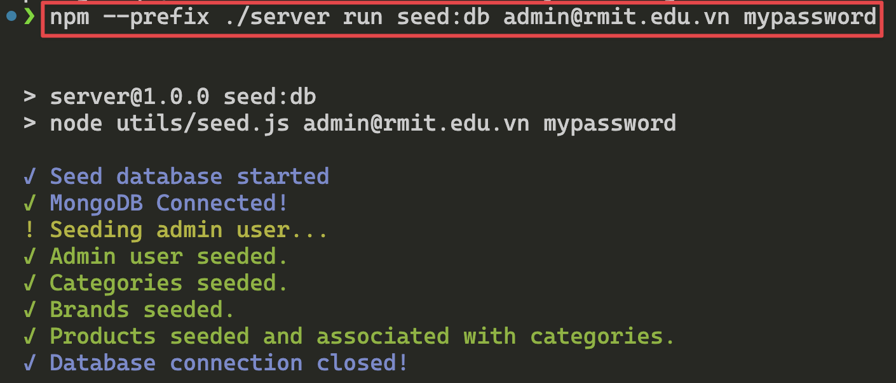
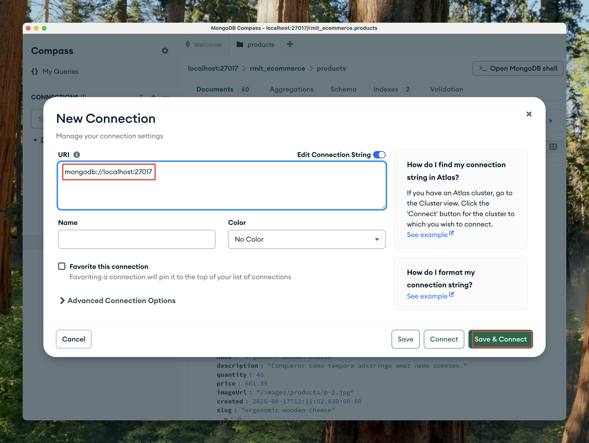
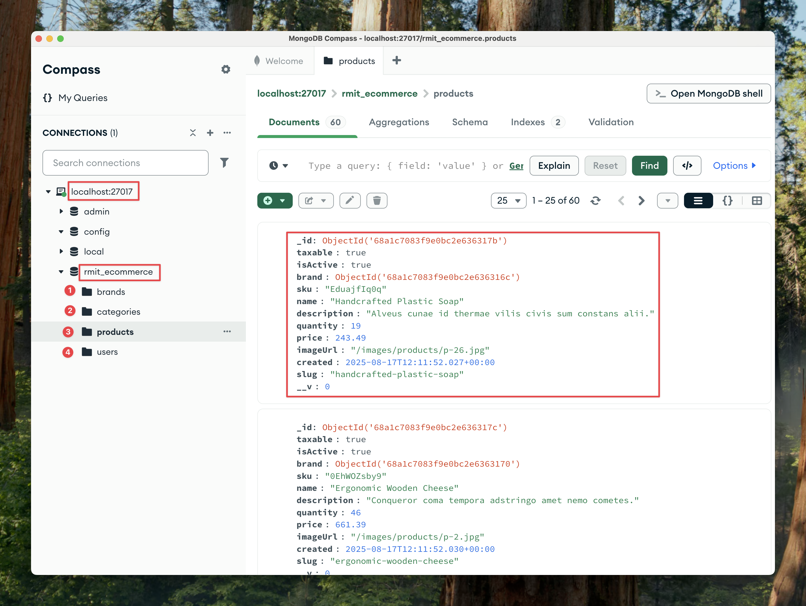
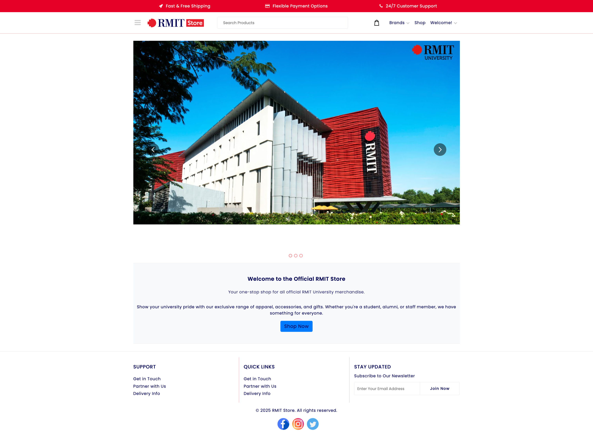
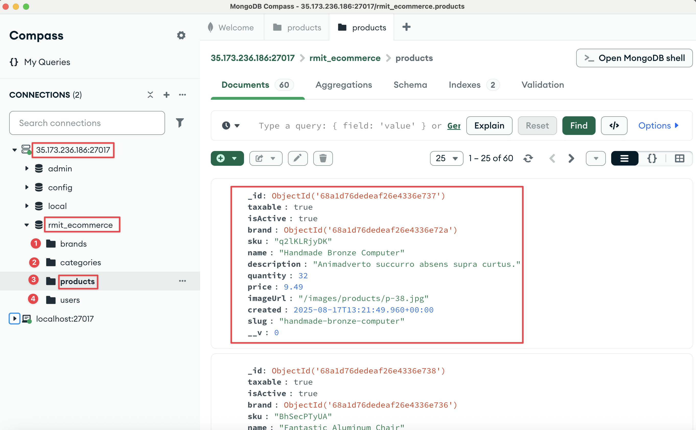
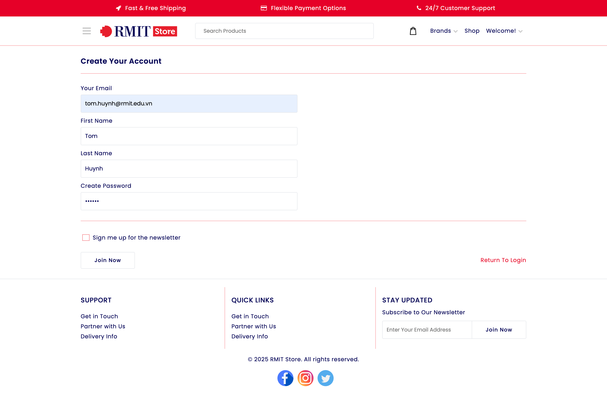
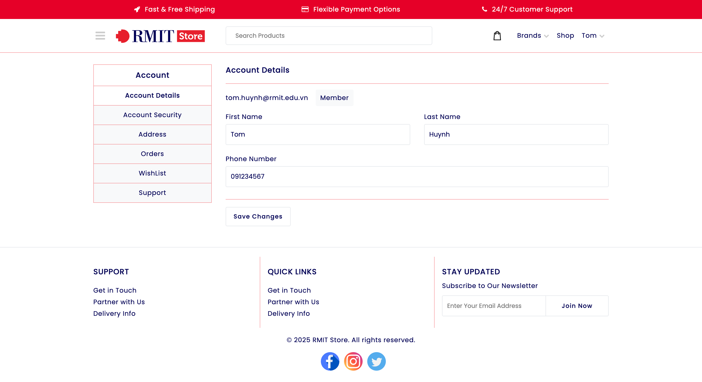
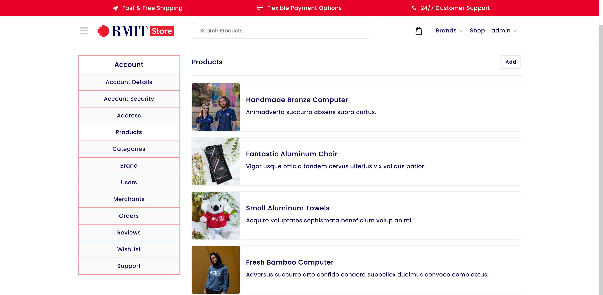
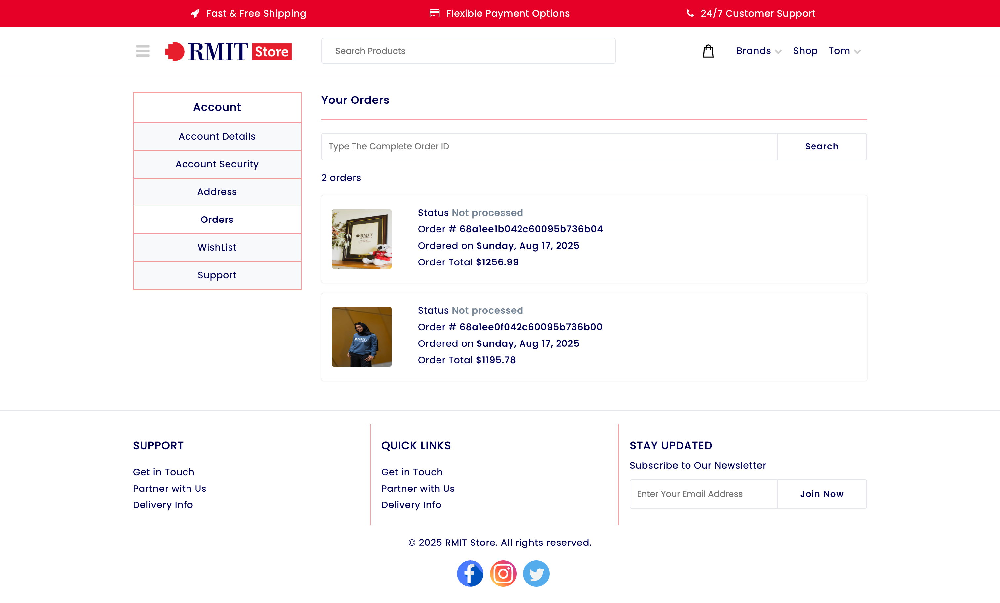

<p align="center">
    
</p>

# RMIT Store 🛒

The RMIT Store is dedicated to selling glorious and wholesome RMIT merchandise, including lanyards, hoodies, T-shirts, cups, and more. It aims to enrich the student experience within the university community by offering a diverse range of services.

Our primary focus is on providing official university apparel and merchandise that fosters a strong sense of identity, inclusivity, and connection among students.

---

## 🔬 What is the MERN Stack?

The MERN stack is a collection of JavaScript-based technologies used to build modern web applications. It consists of:

- **MongoDB**: A NoSQL database for storing application data.
- **Express.js**: A back-end web application framework for Node.js.
- **React**: A front-end library for building dynamic and interactive user interfaces.
- **Node.js**: A runtime environment that executes JavaScript code on the server.

In this project, additional tools and libraries include:

- **Mongoose**: For object modeling with MongoDB.
- **Redux**: For managing the application state.

## 🏪 Features

### For Members (Including Admins):

- **Account Management**:
  - Create a new account or log in securely using email and password.
  - Change account details such as first name, last name, phone, password, and address.

- **Shopping Features**:
  - Browsing different products.
  - Filter products by price and name.
  - Make orders by purchasing products.
  - Check order history.
  - Leave product reviews.
  - Manage wishlist items.

### For Admins:

- **Store Management**:
  - Change, edit, and create products, categories, and brands.
  - Manage user accounts (including members and other admins).
  - Moderate and manage product reviews.

## 🕧 Prerequisites

- **Node.js**: Version 22 or later.
- **MongoDB**: Installed and running locally (for example, MongoDB Community Server) or on cloud (for example, MongoDB Atlas).

## Overview MERN Stack Architecture

Below is an overview of how the components in this architecture are connected:

### Architecture Overview

```mermaid
graph TD
    Browser["🧑‍💻 Browser (Frontend User)"] <-->|Access via port 8080| Client["💻 Client (Frontend)"]
    Client <-->|Connect via port 3000| Server["🛠️ Server (Backend)"]
    Server <-->|Connect via port 27017| Database["🗄️ MongoDB Database"]
```



### Component Connections

1. **Browser**: The user interacts with the frontend of the application (website) via port `8080`.
2. **Frontend (Client)**: Built with **React.js**, the client handles the user interface and connects to the backend server via port `3000`.
3. **Backend (Server)**: Developed using **Node.js** and **Express.js**, the server processes requests from the client and connects to the database.
4. **Database**: The **MongoDB** database stores and retrieves data for the application, communicating with the server via port `27017`.

This clear separation of concerns ensures scalability, flexibility, and modularity in the application.

> **Note**: These port numbers are critical, especially if you plan to run these components as services in containers on different servers. This modular structure supports scalability and can be adjusted based on CI/CD requirements to streamline deployment. 

## 📂 Project Structure

Here is the quick overview of project structure:

```
client/                 # Client-side code (React.js application).
  ├── .env              # Environment variables for the client.
  ├── .env.example      # Example environment variables (backup).
  ├── app/              # Main application code.
  ├── public/           # Public assets.
  │   ├── images/       # Publicly accessible images.
  │   └── index.html    # Entry HTML file for the client.
  ├── webpack/          # Webpack configuration files.
  │   └── webpack.dev.js # Development-specific Webpack configuration.
  └── package.json      # Client dependencies and scripts.

server/                 # Server-side code (Node.js application).
  ├── .env              # Environment variables for the server.
  ├── .env.example      # Example environment variables (backup).
  ├── config/           # Configuration files (e.g., database, server settings).
  ├── middleware/       # Custom Express middleware.
  ├── models/           # Mongoose schemas and models.
  ├── routes/           # Express route handlers.
  ├── utils/            # Utility functions (e.g., helpers).
  ├── index.js          # Server entry point.
  ├── nodemon.json      # Nodemon configuration file.
  └── package.json      # Server dependencies and scripts.

package.json            # Root-level project dependencies and scripts.
.gitignore               # Specifies files and directories to be ignored by Git.
README.md               # Documentation and setup instructions.
```

---

## 📚 Recommended Ways for Beginners to Deploy the Website (From Easy to Hard)

### Plan A: Deploy Locally

**🪟 Window, 🍏 MacOS, or 🐧 Linux**:
   - Follow the instructions in the below "Plan A: Steps to Build, Configure, and Run the Project Locally" section.

### Plan B: Deploy on AWS EC2 (Single Instance)

1. Follow the instructions in the below "Plan B: Configuring and Deploying the Project on AWS EC2" section to deploy both the client and server on a single EC2 instance.

### Plan C: Deploy on AWS EC2 (Separate Instances)

1. Deploy the client and server on two different EC2 instances.
2. Ensure that the client instance can communicate with the server instance by updating the `API_URL` in the client's `.env` file to point to the server instance's public IP.
3. Configure the EC2 Security Groups to allow the required ports to enable the communication between client and server on different EC2 servers.

Note: you can consider to further seperate the server into the backend and the mongodb into seperate services on different servers. This improves modularity and scalability, making the system easier to manage and expand.

### Plan D: Containerize with Docker

1. Create Dockerfiles for both the client and server.
2. Build Docker images for the client and server.
3. Run the client and server in separate Docker containers in different ec2 servers.

### Plan E: Use Docker Compose

1. Create a `docker-compose.yml` file to define multi-container services.
2. Use Docker Compose to orchestrate the client and server containers.
3. This approach is standard in CI/CD pipelines and team-based development environments.

### Plan F: Upgrade to CI/CD Pipeline

Here are some examples to enhance the CI/CD pipeline of the application:

1. CI/CD Automation: Use tools like Jenkins to automate build, test, and deployment processes.
2. Configuration Management: Utilize Ansible to efficiently manage server configurations.
3. Infrastructure as Code (IaC): Leverage AWS CloudFormation to define and provision cloud infrastructure through code. Automate the setup of AWS resources, including EC2 instances, databases, and S3 buckets, and so on.
4. Container Orchestration: Use Kubernetes or Docker Swarm to deploy and scale containers.
5. Monitoring: Implement Prometheus and Grafana for performance monitoring and alerts.
6. Load Balancing: Incorporate AWS Elastic Load Balancer (ELB) if deploying on AWS.
7. Zero Downtime Deployment: Use Blue-Green Deployment or Canary Deployment strategies for seamless updates without service interruption.
8. Testing Enhancements: Incorporate automated unit, integration, and end-to-end (Web UI) tests into the CI/CD pipeline to ensure comprehensive coverage and robust quality across all application layers.

These ideas can further improve reliability, scalability, and operational efficiency for the project.

**Below are the step-by-step guides for Plan A and Plan B to help you get started. 😊**

---


## 🔧 Plan A: Steps to Build, Configure, and Run the Project Locally

### Step 0: Install and Verify Node.js and MongoDB

Install Node.js and MongoDB on your local computer. For detailed instructions:

- **For 🪟 Windows, 🍏 MacOS, and 🐧 Linux**:
  - To install Node.js, follow the instructions at [https://nodejs.org/en/download](https://nodejs.org/en/download).
  - To install MongoDB, follow the instructions at [https://www.mongodb.com/docs/manual/installation/](https://www.mongodb.com/docs/manual/installation/).

  Please make sure to select the appropriate instructions for your specific operating system.

After installation, verify that Node.js and MongoDB are installed correctly by running the following commands in your terminal:

```bash
# Verify Node.js installation
node -v

# Verify npm installation
npm -v

# Verify MongoDB installation
mongod --version
```

Here are some commands you can run to check if MongoDB is currently running after installing it, depending on your operating system:

🔹 **🪟 Windows**

Open Command Prompt (cmd) or PowerShell and run:
```bash
sc query MongoDB
```

If MongoDB is running as a service, you’ll see `STATE: RUNNING`.
If it’s not running, you’ll see `STOPPED`.

Alternatively, you can check processes:
```bash
tasklist /FI "IMAGENAME eq mongod.exe"
```

If you see `mongod.exe`, MongoDB is running.

🔹 **🍏 macOS**

Open Terminal and run:
```bash
brew services list | grep mongodb
```

If you installed via Homebrew, you’ll see `started mongodb-community@<version>`.

If not using Homebrew, you can check with:
```bash
ps aux | grep mongod
```

If you see a `mongod` process (not just the grep one), MongoDB is running.

🔹 **🐧 Linux (Ubuntu / Debian / CentOS / etc.)**

Run:
```bash
systemctl status mongod
```

If MongoDB is running, you’ll see `Active: active (running)`.

For systems without `systemd`, you can also try:
```bash
service mongod status
```

Or check processes:
```bash
ps aux | grep mongod
```

✅ **Universal check on all OS**

If you want a quick test across platforms, just try connecting with the MongoDB shell:
```bash
mongosh
```

If it connects successfully, MongoDB is running.

### Step 1: Install Dependencies

At the root of the project, install all dependencies:

```bash
npm install
```

Running `npm install` at the root of the project will install dependencies for both the client and server. Specifically, by running that command, it will automatically:

1. Navigate to the `client` directory and install dependencies listed in `package.json`.
2. Navigate to the `server` directory and install dependencies listed in `package.json`.

Alternatively, for experimentation, you can choose to install dependencies separately for each folder by running `npm install` in the `client` and `server` directories individually. However, for convenience, we recommend running `npm install` at the root to handle both in one go.

### Step 2: Populate the Database

Get started quickly with pre-populated data:

- **Admin User**: Creates an admin user with the provided email and password.
- **Categories**: Seeds categories with random names and descriptions.
- **Brands**: Seeds brands with random names and descriptions.
- **Products**: Seeds products with random details such as SKU, name, description, quantity, price, and image URL. Products are associated with categories and brands.

If you want to seed the MongoDB database with initial data, run the following command. Replace `admin@rmit.edu.vn` and `mypassword` with your desired admin credentials:

```bash
npm --prefix ./server run seed:db admin@rmit.edu.vn mypassword
```

<p align="center">
    
</p>

> **Disclaimer:** The product data (including names, descriptions, and images) is generated using the [`@faker-js/faker`](https://fakerjs.dev/) library for demonstration purposes only. It does not represent real products from the actual RMIT Store.

[Optional] You can use MongoDB Compass to explore the database data by connecting to it using the MongoDB URI. When connecting to a local MongoDB database, the default URI is `mongodb://localhost:27017`.

<p align="center">
    
</p>

<p align="center">
    
</p>


### Step 3: Run the Project

To start the project, at the root of the project, use the following command:

```bash
npm run dev
```

Running `npm run dev` at the root of the project will start for both the client (frontend) and server (backend). Specifically, by running that command, it will automatically:

1. Navigate to the `client` directory and run the command `npm run dev` to start the client.
2. Navigate to the `server` directory and run the command `npm run dev` to start the server.

Alternatively, you can choose to run each of them separately. However, for convenience, we recommend running `npm run dev` at the root to run both in one go.

The website should now be accessible at:

```
http://0.0.0.0:8080 or http://localhost:8080 
```
<p align="center">
    
</p>

After deploying the website, you can create your own account for a normal member to start browsing and buy products, leave reviews, or log in as an admin where you can have more administration rights.

## 🕧 Summary of Commands

Here is a quick reference for the commands to build and populate the project:

```bash
# Install dependencies
npm install

# Populate the database
npm --prefix ./server run seed:db admin@rmit.edu.vn mypassword

# Run the project
npm run dev
```

## 🚀 Plan B: Configuring and Deploying the Project on AWS EC2

### Step 1: Launch an EC2 Instance

1. Log in to the AWS Management Console.
2. Launch a new EC2 instance with the following specifications:
   - Choose the **Amazon Linux 2023 AMI**.
   - Select an instance type (e.g., t3.micro for free-tier eligibility). You might consider temporarily upgrading to a more powerful tier, such as t3.medium or t3.small, if the free-tier instance is too slow to build the project initially. The build process on a free-tier instance should take less than 2 minutes.
   - Configure security groups to allow inbound traffic on ports **3000** (backend) and **8080** (frontend).

### Step 2: Install Node.js and npm

For more detailed instructions, you can refer to the official Node.js documentation at [https://nodejs.org/en/download](https://nodejs.org/en/download). On that page, select the instructions to install Node.js v22.x.x (LTS) for Linux using a node version manager (fnm).

1. Connect to your EC2 instance via SSH.
2. Install Node.js and npm:
   ```bash
   # Install fnm
   curl -fsSL https://fnm.vercel.app/install | bash

   # Activate fnm
   source ~/.bashrc

   # Install and use Node.js version 22
   fnm use --install-if-missing 22

   # Verify Node.js installation
   node -v

   # Verify npm installation
   npm -v
   ```

### Step 3: Install MongoDB

For more detailed instructions, you can refer to the official MongoDB documentation on [installing MongoDB on Amazon Linux](https://www.mongodb.com/docs/manual/tutorial/install-mongodb-on-amazon/).

1.  **Configure the repository.**

    Create a `/etc/yum.repos.d/mongodb-org-8.0.repo` file so that you can install MongoDB directly using `yum`:

    ```bash
    [mongodb-org-8.0]
    name=MongoDB Repository
    baseurl=https://repo.mongodb.org/yum/amazon/2023/mongodb-org/8.0/x86_64/
    gpgcheck=1
    enabled=1
    gpgkey=https://pgp.mongodb.com/server-8.0.asc
    ```

2.  **Install MongoDB Community Server.**

    To install the latest stable version of MongoDB, run the following command:

    ```bash
    sudo yum install -y mongodb-org
    ```

3.  **Start MongoDB.**

    You can start the `mongod` process by issuing the following command:

    ```bash
    sudo systemctl start mongod
    ```

    If you receive an error similar to the following when starting `mongod`:
    `Failed to start mongod.service: Unit mongod.service not found.`

    Run the following command first:

    ```bash
    sudo systemctl daemon-reload
    ```

    Then run the start command above again.

4.  **Verify that MongoDB has started successfully.**

    You can verify that the `mongod` process has started successfully by issuing the following command:

    ```bash
    sudo systemctl status mongod
    ```

    You can optionally ensure that MongoDB will start following a system reboot by issuing the following command:

    ```bash
    sudo systemctl enable mongod
    ```

### Step 4: Clone the Project and Set It Up

1. Clone your project repository:
   ```bash
   git clone <your-git-repo-url>
   cd COSC2767-RMIT-Store
   ```
2. Install project dependencies:
   ```bash
   npm install
   ```
   For the free-tier EC2 instance like t3.micro (2 vGPU & 1 GB Memory), it should take less than 2 minutes to build. If the build process (npm install) is slow for you, consider temporarily upgrading to a higher-tier EC2 instance t3.medium (e.g., 2 vCPU and 4 GB RAM) to speed up the initial setup. Once completed, you can downgrade to a free-tier instance to save costs. Personally, I'm happy with the free-tier t3.small (2 vGPU & 2 GB Memory) as the performance is acceptable!
   
### Step 5: Configure Environment Variables

1. Update the `.env` file for both the client and server to use the public IP address of your EC2 instance.
2. Set the `API_URL` in the `.env` file to point to your EC2 instance:
   ```env
   API_URL=http://<your-ec2-public-ip>:3000/api
   ```

This step ensures that the frontend can communicate with the backend hosted on your EC2 instance. By updating the `API_URL` to the public IP of your EC2 instance, the client application will correctly send API requests to the server. 

### Step 6: Populate the Database

If you want to seed the MongoDB database with initial data, run the following command. Replace `admin@rmit.edu.vn` and `mypassword` with your desired admin credentials:

```bash
npm --prefix ./server run seed:db admin@rmit.edu.vn mypassword
```

### Step 7: Check Security Group Settings

1. Ensure that the security group associated with your EC2 instance allows inbound traffic on:
   - Port 3000 (backend)
   - Port 8080 (frontend)
2. Verify that the environment variables are correctly configured as per the previous step.

### Step 8: Start the Project

Run the project using the standard command:

```bash
npm run dev
```

The frontend should now be accessible at `http://<your-ec2-public-ip>:8080`, and the frontend and backend should communicate properly.

### [Optional] Step 9: Configure MongoDB for Remote Connections (e.g., from MongoDB Compass)

If you want to manage your EC2-hosted MongoDB database using a local tool like MongoDB Compass, you need to allow remote connections. By default, MongoDB on EC2 is configured for security to only accept connections from the machine itself.

1.  **Check the Current MongoDB Network Status:**

    Before making changes, check which network interface MongoDB is listening on. Run the following command in your EC2 terminal:
    ```bash
    sudo ss -tulpn | grep 27017
    ```
    The output will look like this:
    ```
    tcp   LISTEN 0      4096                         127.0.0.1:27017      0.0.0.0:*    users:(("mongod",pid=25678,fd=9))
    ```
    This output shows that `mongod` is listening only on `127.0.0.1:27017`. This means it will only accept connections originating from within the EC2 instance (`localhost`). Any external connection attempt, like from MongoDB Compass on your laptop, will be refused.

2.  **Edit the MongoDB Configuration File:**

    To allow remote connections, you need to change this setting. Open the `mongod.conf` file:
    ```bash
    sudo nano /etc/mongod.conf
    ```

3.  **Update the `bindIp` Address:**

    Locate the `net` section and change `bindIp` from `127.0.0.1` to `0.0.0.0`.

    *From:*
    ```yaml
    net:
      port: 27017
      bindIp: 127.0.0.1
    ```

    *To:*
    ```yaml
    net:
      port: 27017
      bindIp: 0.0.0.0
    ```

4.  **Restart MongoDB:**

    Apply the changes by restarting the MongoDB service:
    ```bash
    sudo systemctl restart mongod
    ```

5.  **Verify the New Network Status:**

    Run the check command again:
    ```bash
    sudo ss -tulpn | grep 27017
    ```
    The output should now show that MongoDB is listening on all network interfaces (`0.0.0.0`):
    ```
    tcp   LISTEN 0      4096                           0.0.0.0:27017      0.0.0.0:*    users:(("mongod",pid=29413,fd=9))
    ```
    This confirms that MongoDB will now accept connections from external sources.

> **⚠️ Important Security Warning:** Binding MongoDB to `0.0.0.0` makes your database accessible from the entire internet. To protect your data, you **must** restrict access in your EC2 Security Group.
>
> -   Go to your EC2 instance's Security Group settings.
> -   Find the inbound rule for port **27017**.
> -   Change the **Source** from `Anywhere` (`0.0.0.0/0`) to **`My IP`**. This ensures only your computer can connect to the database.

After these steps, you can connect to your database using the connection string: `mongodb://<your-ec2-public-ip>:27017/`.

<p align="center">
    
</p>

---

## 🌱 Setting Up Environment Variables

To configure additional settings, such as port numbers and endpoint addresses, check the environment variables in the client and server directories (client/.env and server/.env).

Below are examples of .env files for hosting both the client and server on the same machine, such as localhost or an AWS EC2 instance.

### Client `.env` File

**Local Example:**
```
API_URL=http://localhost:3000/api 
```

**AWS EC2 Example:**
```
API_URL=http://<your-ec2-public-ip>:3000/api
```

### Server `.env` File

**Local Example:**
```
PORT=3000
MONGO_URI=mongodb://localhost:27017/rmit_database
JWT_SECRET=my_secret_string
CLIENT_URL=http://localhost:8080
BASE_API_URL=api
```

**AWS EC2 Example (Single Instance Deployment):**
```env
PORT=3000
MONGO_URI=mongodb://localhost:27017/rmit_database # Use localhost for same-machine DB connection
JWT_SECRET=my_secret_string
CLIENT_URL=http://<your-ec2-public-ip>:8080
BASE_API_URL=api
```
> **💡 Important Note on `MONGO_URI`**: When your server and MongoDB are on the same EC2 instance, always use `localhost` (or `127.0.0.1`) for the `MONGO_URI`. This ensures a direct, secure, and fast internal connection. Using the public IP would force an unnecessary and often blocked external connection back to the same machine.

**Important:** Replace `<your-ec2-public-ip>` with your actual EC2 instance's public IP address. The value `0.0.0.0` is a wildcard that means "listen on all available network interfaces," which is useful in environments like Docker or when you're unsure which IP will be assigned.

## 🌐 Configuring Webpack Dev Server

To ensure the webpack dev server is correctly configured for both local and EC2 deployments, update the `devServer` settings in `client/webpack/webpack.dev.js` as follows:

**Local Deployment:**
```javascript
devServer: {
  port: 8080,
  host: 'localhost', // Listen on localhost network
  ...
}
```

**EC2 Deployment:**
```javascript
devServer: {
  port: 8080,
  host: '0.0.0.0', // Listen on all interface network
  ...
}
```

This configuration ensures that the webpack dev server listens on the appropriate network interface based on the deployment environment.


The `client/` and `server/` directories are isolated, promoting independent development and deployment.

## 🔐 Developer Notes

- Ensure that MongoDB is running locally or that your MongoDB Atlas cluster is properly configured.
- The client communicates with the server via the `/api` endpoint.
- Make sure the `.env` files are properly set up for both the client and server.

## 📸 Screenshots

<p align="center">
    
</p>
<p align="center">
    
</p>
<p align="center">
    
</p>
<p align="center">
    
</p>
<p align="center">
    
</p>
<p align="center">
    
</p>

## 🏆 Author
- Tom Huynh - tomhuynhsg@gmail.com
