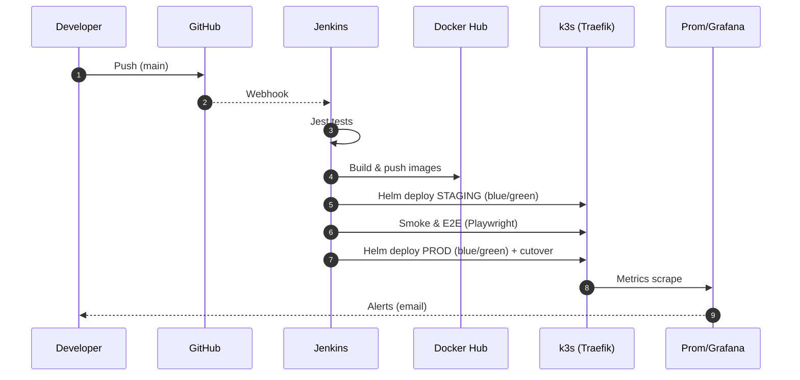
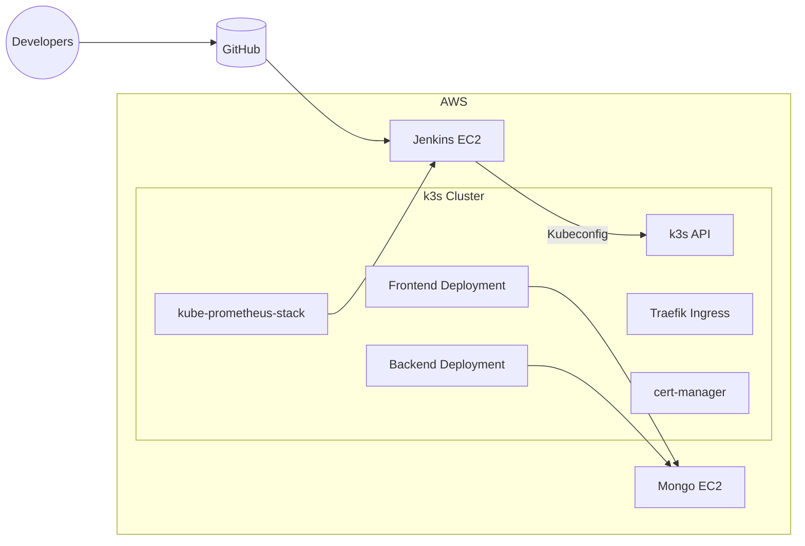
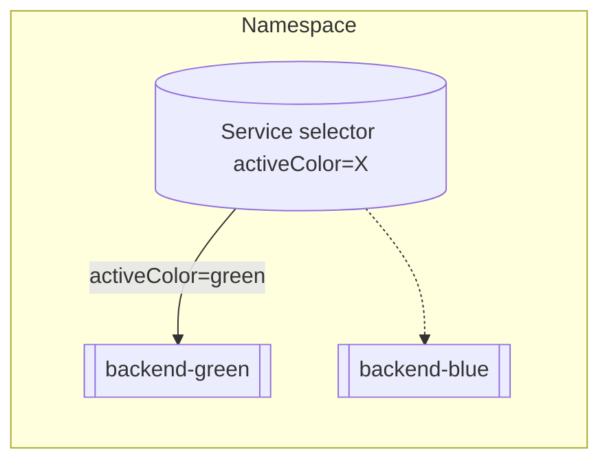
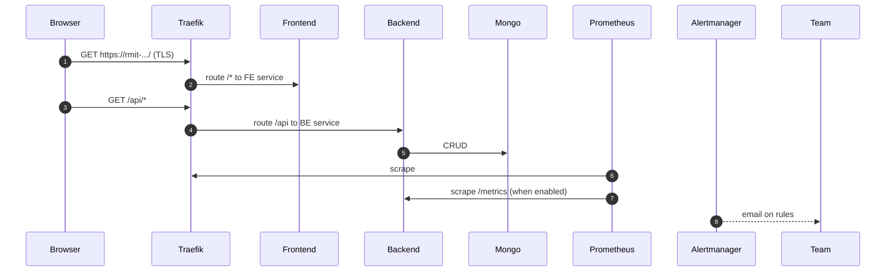

## RMIT Store DevOps Overview

This documents the end‑to‑end infrastructure, CI/CD, testing, monitoring and run‑ops for the RMIT Store (MERN) on AWS.

### Goals
- Repeatable, automated infra + app delivery on AWS
- Containerized microservices (frontend, backend, db)
- Kubernetes orchestration (k3s)
- CI/CD via Jenkins (JCasC), Ansible, Helm
- Blue/Green deployments with health checks and rollback
- Observability with Prometheus/Grafana/Alertmanager
- TLS via cert‑manager + Let’s Encrypt

### High‑level Flow

### System Context

1) Code push → GitHub webhook → Jenkins pipeline
2) Jenkins runs Jest tests; builds/pushes Docker images
3) Jenkins deploys to staging (Helm), smokes and E2E (Playwright)
4) If OK, deploys to prod (Helm), smokes, then cutover Blue→Green
5) Prometheus scrapes metrics; Alertmanager emails criticals

### Primary Components
- AWS EC2: Jenkins, k3s master, 2 workers (frontend/backend tiers), Mongo host
- k3s: Traefik ingress, cert‑manager, kube‑prometheus‑stack
- Jenkins: Docker runner, JCasC, job creation via REST, email notifications
- Ansible: provisioning + configuration roles
- Helm: rmit-store chart for app; kube‑prometheus‑stack for observability

### Environments & URLs
- We use nip.io for IP‑based DNS. If master public IP is `35.153.118.162`, hosts are:
  - Staging frontend/backend: `rmit-staging.35-153-118-162.nip.io`
  - Prod frontend/backend:    `rmit-prod.35-153-118-162.nip.io`
- TLS: cert‑manager obtains Let’s Encrypt certificates automatically for ingress rules.

### Blue/Green at a glance

Jenkins always deploys the new revision to GREEN. After rollout and health succeed, Services are patched to `activeColor=green` (cutover). On failure, Helm rolls back to the previous revision.

### Secrets & Configuration (where they live)
- Jenkins JCasC (rendered by Ansible):
  - Global envs: `BASE_URL`, `STAGING_HOST`, `PROD_HOST`, `MONGO_URI`, `DH_NS`
  - Credentials: `dockerhub` (user/PAT), `github-token` (PAT), `kubeconfig-master` (file)
- Ansible group vars: DockerHub, GitHub, SMTP settings, k3s kubeconfig export
- Pipeline‑only: `email-to` (optional secret text list of recipients)

### Data Flow (runtime)

### Personas
- Developer: pushes to GitHub; checks Jenkins & Grafana; triages alerts
- Operator: runs Ansible; rotates credentials; manages scaling & certificates

