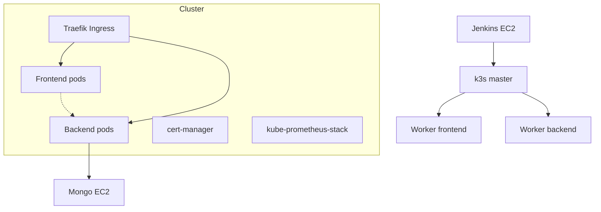

## Architecture

### Topology

- VPC with public subnets for:
  - Jenkins EC2 (public IP)
  - k3s master (public + private IP)
  - k3s workers (private IP; accessible from master)
  - Mongo EC2 (public IP for Ansible provisioning; Mongo port 27017 exposed locally on host only)

### Hosts / Roles
- Jenkins EC2:
  - Docker runtime
  - Jenkins (Docker) with JCasC & plugins
  - Builds containers; talks to k3s via kubeconfig (private IP)
- k3s Master EC2:
  - k3s server (Traefik ingress, cert‑manager, Helm)
  - kube‑prometheus‑stack (Prometheus/Grafana/Alertmanager)
  - Exports kubeconfig rewritten to private IP for Jenkins
- k3s Workers EC2:
  - Schedules frontend/backend pods
- Mongo EC2:
  - MongoDB in Docker (volume on /var/lib/mongo)
  - One‑time seeding via Node container; guarded by /.seeded flag and post‑verify

### Networking
- Ingress: Traefik (k3s default)
- DNS: nip.io (dashed IP hostnames) for staging/prod
- TLS: cert‑manager (ClusterIssuer letsencrypt)
- Jenkins → k3s: via kubeconfig (server=https://<master‑priv‑ip>:6443)

### Security & Access
- SSH: security groups restrict SSH ingress to your controller IP
- Secrets: stored in Jenkins credentials and Ansible group vars; kubeconfig mounted as a file credential in the pipeline
- Mongo: bound to host 27017; only seeding container on same host connects via 127.0.0.1

### Blue/Green objects (app chart)
- Deployments: `backend-blue`, `backend-green`, `frontend-blue`, `frontend-green`
- Services: stable selectors on `app=<svc>` and `activeColor=<blue|green>`
- Values: `backend.activeColor`, `frontend.activeColor` set by pipeline per environment

