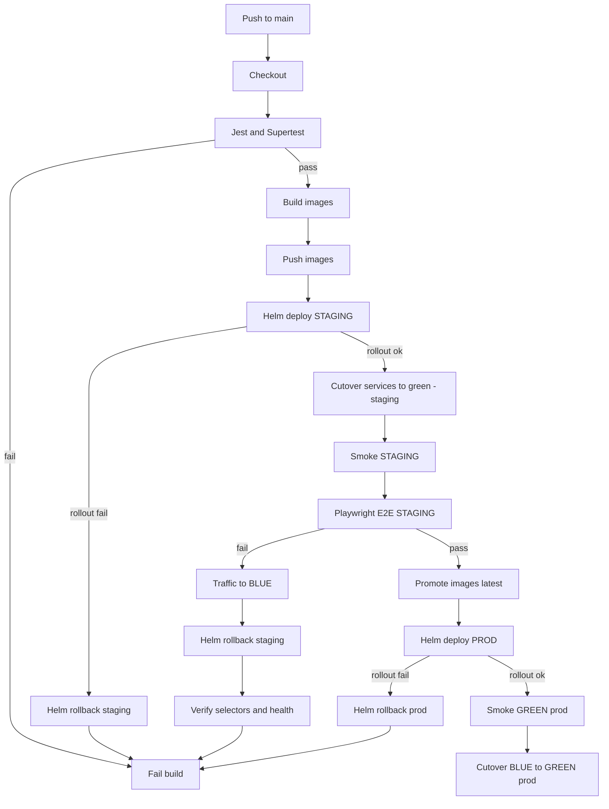

## CI/CD Pipeline

### Triggers
- GitHub webhook → Jenkins job `RMIT-Store` (push to main)

### Stages

### Detailed step‑by‑step
1) Checkout
   - Triggered by a GitHub webhook on push to `main`.
   - Jenkins checks out the repo into the agent workspace.

2) Server tests (Jest + Supertest)
   - Runs inside a clean `node:20-bullseye` container for consistent tooling.
   - Commands: `npm ci && npm test -- --coverage --ci` in the `server/` folder.
   - What it covers: unit tests and API tests (health, products, auth basics).
   - Artifacts: coverage folder is archived for later review.
   - Failure behavior: pipeline stops here with a red build.

3) Build images (Docker)
   - Backend: `docker build` → `${DH_NS}/rmit-store-backend:${GIT_COMMIT}`.
   - Frontend: `docker build --build-arg API_URL=/api` → `${DH_NS}/rmit-store-frontend:${GIT_COMMIT}`.
   - BuildKit cache is enabled to speed up repeated builds.

4) Push images (Docker Hub)
   - Logs into Docker Hub using Jenkins credentials id `dockerhub`.
   - Pushes both commit‑tagged images so clusters can pull exactly this build.

5) Deploy STAGING (Helm)
   - Uses kubeconfig credential (mounted read‑only) to access the k3s API.
   - `helm upgrade --install rmit-store-staging` into the `staging` namespace.
   - Values passed: commit‑tag images, `mongo.uri`, and `host` (Ingress).
   - Waits for deployments to roll out. If rollout fails, performs a Helm rollback and exits.
   - On success, flips Services’ selectors to point to `activeColor=green` (blue/green pattern).

6) Smoke STAGING
   - Simple availability check: `curl http://$STAGING_HOST/api/health` must return HTTP 200.

7) E2E STAGING (Playwright)
   - Runs in the official Playwright container with Chromium/FFmpeg preinstalled.
   - Environment variables: `BASE_URL=http://$STAGING_HOST`, `ADMIN_EMAIL`, `ADMIN_PASS`.
   - Covers key user journeys (login, list products, place an order, admin add/delete product).
   - If E2E FAILS:
     - Traffic rollback: patch `Service` selectors back to `activeColor=blue`.
     - Release rollback: compute previous Helm revision and `helm rollback rmit-store-staging <prev>`.
     - Verification: assert selectors are `blue` and `/api/health` is OK.
     - The build is marked UNSTABLE and prod stages are skipped.
   - If E2E PASSES:
     - Sets `E2E_OK=1` to allow downstream promotion and production deployment.

8) Promote images `:latest` (only on success)
   - Tags commit images as `:latest` and pushes them.
   - Keeps commit tags for traceability; `:latest` is for convenience.

9) Deploy PROD (Helm, gated by E2E_OK)
   - Mirrors staging deploy: commit images, `mongo.uri`, and `host` for prod.
   - Waits rollouts; if a rollout fails, performs a Helm rollback and exits.

10) Smoke GREEN (prod)
    - `curl http://$PROD_HOST/api/health` must return HTTP 200.

11) Cutover BLUE → GREEN (prod)
    - Patches Service selectors in `prod` to point to `activeColor=green`.
    - Optional enhancement: a short post‑cutover health loop can auto‑revert to blue.

12) Summary + artifacts
    - Build description lists staging/prod URLs.
    - HTML Publisher exposes an “HTML Report” with the same links.
    - Emails are sent on success/failure (SMTP configured via JCasC/Ansible).

### Notifications
- Core mailer on success/failure (recipient from Jenkins credential `email-to` or `EMAIL_TO` env)
- Jenkins summary panel lists staging/prod links (FE + BE health)
- HTML Publisher: “HTML Report” with clickable staging/prod links

### Jenkinsfile highlights
- Uses Docker containers for consistent Node/Helm/kubectl runtime
- Copies kubeconfig credential to workspace and mounts read‑only
- Single quotes in shell blocks avoid Groovy interpolation pitfalls
- Auto‑rollback on rollout errors; prints diagnostics (deploy/rs/pods, describe, logs)
- E2E gating: prod deploy/cutover only when E2E passes (`E2E_OK=1`)
- Staging E2E failure triggers two-level rollback:
  - Traffic rollback: patch Services to `activeColor=blue`
  - Release rollback: `helm rollback rmit-store-staging <previous>` and rollout wait for `*-blue`
- HTML Publisher publishes a build summary with links

### Operate the pipeline
- Push to `main` → pipeline runs automatically
- On E2E failure: pipeline reverts staging to BLUE and stops before prod
- On success: images are promoted to `:latest`, prod deploys and is cut over to GREEN

