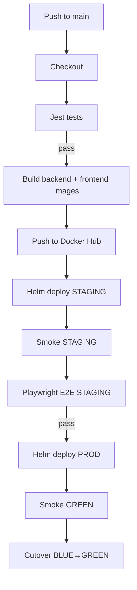

## CI/CD Pipeline

### Triggers
- GitHub webhook → Jenkins job `RMIT-Store` (main branch)

### Stages

1) Checkout
2) Server tests (Jest)
   - Runs in Node container; `npm ci && npm test` (with coverage)
3) Build images
   - Backend: `docker build` → `${DH_NS}/rmit-store-backend:${GIT_COMMIT}`
   - Frontend: `docker build --build-arg API_URL=/api` → `${DH_NS}/rmit-store-frontend:${GIT_COMMIT}`
4) Push images to Docker Hub
5) Deploy STAGING (Helm)
   - Sets images, `mongo.uri`, and `host`
   - Waits rollout; rollback on failure
   - Cutover Services to green
6) Smoke STAGING
   - `curl http://$STAGING_HOST/api/health`
7) E2E STAGING (Playwright)
   - Runs tests inside Playwright container against staging
8) Deploy PROD (Helm)
   - Same as staging
9) Smoke GREEN (prod)
10) Cutover BLUE→GREEN (prod)

### Notifications
- Core mailer on success/failure (recipient from Jenkins credential `email-to` or `EMAIL_TO` env)
- Jenkins summary panel lists staging/prod links (FE + BE health)

### Jenkinsfile highlights
- Uses Docker containers for consistent Node/Helm/kubectl runtime
- Copies kubeconfig credential to workspace and mounts read‑only
- Single quotes in shell blocks avoid Groovy interpolation pitfalls
- Auto‑rollback on rollout errors; prints diagnostics (deploy/rs/pods, describe, logs)
- Staging services auto‑patched to green post‑rollout; prod cutover in dedicated stage

