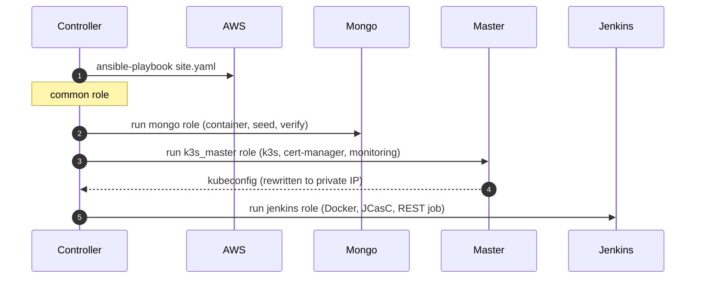
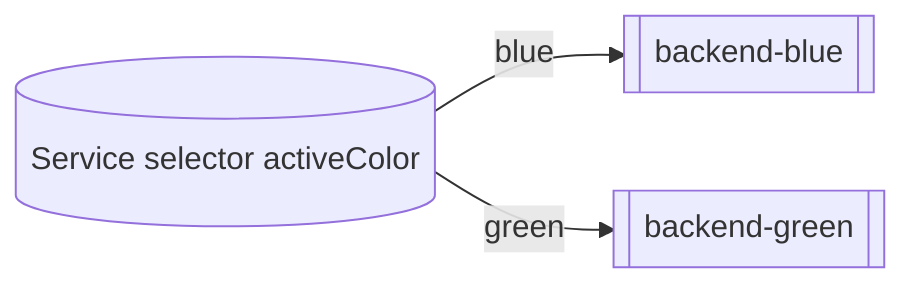
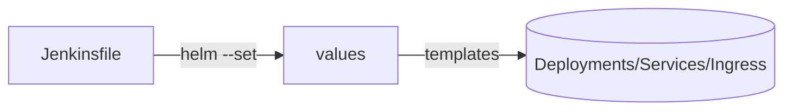

## 6. Code Architecture (Ansible & Helm)

### Ansible layout
```
rmit-aws/
├─ ansible/
│  ├─ site.yaml                # main play (common, mongo, k3s_master, k3s_worker, jenkins)
│  ├─ inventory.ini            # generated by Makefile
│  ├─ group_vars/all.yaml      # generated from .env + ec2-outputs
│  └─ roles/
│     ├─ common/               # base packages, docker, users
│     ├─ mongo/                # mongo container + one‑time seed + verify
│     ├─ k3s_master/           # k3s server, cert‑manager, kube‑prom stack, kubeconfig export
│     ├─ k3s_worker/           # k3s agent join (labels optional)
│     └─ jenkins/              # Jenkins (Docker), JCasC, plugins, job via REST, webhook
└─ jenkins/
   └─ casc.yaml.j2             # JCasC template (rendered by role)
```

Ansible flow


Seeding safeguards
- Seed script is invoked with admin email/pass
- `.seeded` flag is created only if post‑verify shows non‑zero users/products

### Helm chart layout (rmit-store)
```
helm/rmit-store/
├─ Chart.yaml
├─ values.yaml                 # defaults (overridden per env)
├─ values-staging.yaml         # env values (host, monitoring enabled)
├─ values-prod.yaml
└─ templates/
   ├─ backend-deploy-blue.yaml
   ├─ backend-deploy-green.yaml
   ├─ backend-service.yaml
   ├─ backend-ingress.yaml
   ├─ frontend-deploy-blue.yaml
   ├─ frontend-deploy-green.yaml
   ├─ frontend-service.yaml
   ├─ frontend-ingress.yaml
   ├─ backend-servicemonitor.yaml  # gated by .Values.monitoring.enabled
   └─ prometheusrules.yaml         # app alerts (restarts, 5xx, cert expiry)
```

Blue/Green wiring

Jenkins sets:
- `--set backend.greenImage, frontend.greenImage`
- `--set backend.activeColor=<blue|green>, frontend.activeColor=<...>`
- `--set host=<staging/prod host>`
- `--set-string mongo.uri=<URI>`

Ingress & TLS
- Ingress objects use `ingressClassName: traefik`
- `cert-manager.io/cluster-issuer: letsencrypt` annotation issues certs automatically

Monitoring toggles
- `monitoring.enabled: true` enables ServiceMonitor & PrometheusRule
- kube‑prometheus‑stack is installed by Ansible on the master

### CI/CD ↔ Chart mapping

Key mappings:
- `STAGING_HOST/PROD_HOST` → `.Values.host` (frontend/backend ingresses)
- Image digests from build → `.Values.backend.greenImage` / `.Values.frontend.greenImage`
- `MONGO_URI` → `.Values.mongo.uri`

### Local tips
- Render templates without installing:
  `helm template rmit-store ./helm/rmit-store -f values-staging.yaml --set host=example.test`
- Dry‑run upgrade:
  `helm upgrade --install rmit-store-staging ./helm/rmit-store -n staging --dry-run --debug ...`

